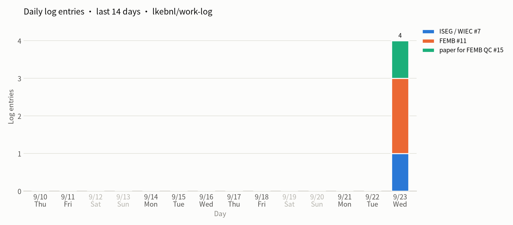
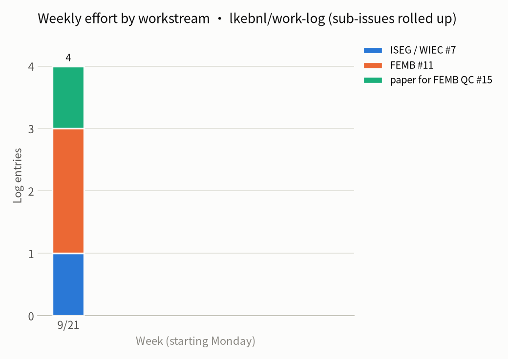

# work-log 使用说明

这个仓库用 GitHub Issues + Projects 记录日常工作，每周自动生成周报和精力分布图。本文整理了搭建过程中的常见问题。

- [1. 基本概念](#1-基本概念)
- [2. 日常怎么记](#2-日常怎么记)
- [3. Issue 和代码关联](#3-issue-和代码关联)
- [4. Project 看板](#4-project-看板)
- [5. 自动周报与精力分布图](#5-自动周报与精力分布图)
- [6. 分享与权限](#6-分享与权限)
- [7. Copilot 相关](#7-copilot-相关)
- [8. 可视化方案一览](#8-可视化方案一览)

---

## 1. 基本概念

**Issue 是什么？**
一张任务单/工单：开启 → 讨论、处理 → 关闭。可以类比 QC 里的 NCR：记录问题、指派处理、记录排查过程、结案。git 记录代码"改了什么"，issue 记录"为什么改、要处理什么"。有些 issue 不需要改代码，查清楚后直接关闭。

**Issue 和 branch 什么关系？**
没有直接关系。issue、comment、看板都存在 GitHub 平台上，不在 git 里：
- `git clone` 不会下载 issue；
- 切换或删除 branch 不影响 issue；
- 两者只能通过 `#编号` 引用建立链接（见第 3 节）。

备份 issue 要单独导出：

```bash
gh issue list -R lkebnl/work-log --state all --limit 500 \
  --json number,title,body,comments > issues_backup.json
```

**本仓库的结构**

| 层级 | 用途 | 状态 |
|---|---|---|
| 工作线 issue（`[FEMB]`、`[WIB]`、`[Cable]`……） | 相当于 Epic，长期开着 | 不关闭 |
| sub-issue（如 "验证 V-I 曲线 DAQ 采数"） | 有明确终点的具体任务 | 完成就关闭 |
| comment | 每天的进展记录 | — |

---

## 2. 日常怎么记

1. 每天的进展写在对应 issue 的 comment 里。
2. 有明确完成标准的事，单独开 issue，挂到工作线下面作为 sub-issue：
   - 网页：打开父 issue → 正文下方 **Create sub-issue**，或 **Add existing issue**；
   - 命令行（API 需要内部 id，不是编号）：
     ```bash
     gh issue create -R lkebnl/work-log --title "验证 V-I 曲线 DAQ 采数" \
       --body "完成标准：曲线与预期一致，数据存档。"
     ID=$(gh api repos/lkebnl/work-log/issues/<新编号> --jq .id)
     gh api repos/lkebnl/work-log/issues/<父编号>/sub_issues -F sub_issue_id=$ID
     ```
3. 写 sub-issue 时加一句**完成标准**，避免任务一直拖着关不掉。
4. sub-issue 的 comment 在周报和精力图里会自动归入它的顶层工作线。

**Issues 列表为什么不显示父子层级？**
列表页是扁平的，父子关系只显示为父 issue 旁的进度（如 `0/1`）。想看层级：
- 只看顶层：`is:issue state:open no:parent-issue`
- 只看某条线的子任务：`parent-issue:lkebnl/work-log#11`
- 在 Project 表格里点左侧 `›` 展开，或在视图菜单里打开 **Show hierarchy**
- 打开父 issue，看 **Sub-issues** 区域

---

## 3. Issue 和代码关联

| 写法（commit 信息或 PR 描述） | 效果 |
|---|---|
| `refs #7` 或 `#7` | 在 issue 时间线上建立链接 |
| `Fixes #7` / `Closes #7` / `Resolves #7` | PR 合并进默认分支时**自动关闭** #7 |
| `refs lkebnl/work-log#7` | 跨仓库引用 |
| `Fixes lkebnl/work-log#7` | 跨仓库自动关闭（需对 work-log 有写权限） |

> ⚠️ 长期工作线 issue 只用 `refs`，**不要用 `Fixes`**，否则 PR 一合并整条线就被关掉。`Fixes` 只用于 sub-issue。

从 issue 开分支：
- 网页：issue 右侧 **Development → Create a branch**，对话框里可以把 Repository 换成代码仓库（如 FEMB_QC）；
- 命令行：`gh issue develop 7 --checkout`

推荐结构：**work-log 放工作线 → 各代码仓库放代码和具体改动 → 一个 Project 看板汇总所有仓库的 issue**。私有仓库的引用会显示在公开 issue 里，但没有权限的人看不到内容。

---

## 4. Project 看板

**View 是什么？**
同一批数据的不同显示方式（筛选 + 分组 + 排序 + 布局），不改变数据。条目少时一个表格就够；sub-issue 多了以后再加：

| 视图 | 用途 |
|---|---|
| Board，按 Status 分列 | 看进度，拖卡片改状态 |
| 表格，筛选 `status:"In Progress"` | 只看手上正在做的事 |
| 表格，Group by 工作线 | sub-issue 多时按线归拢 |
| Roadmap | 任务填了起止日期后看排期 |

**Roadmap 视图说明**
- 红线 = 今天；每个条目按日期字段放置。
- 只有一个日期时显示为一个点，填了起止日期才显示为条形。
- 没填日期的行显示 `+`，点它可以直接设日期。
- 用的是哪个日期字段：视图菜单 ▾ → **Date fields**。

**清除日期**
- 批量：切到表格视图 → 选中日期列的格子（Shift 多选）→ 按 Delete；
- 单个：打开 issue 侧栏 → 日期字段 → **Clear**。

**删除或改布局**
视图标签旁的 ▾ → **Delete view**（只删显示方式，不删数据），或 **Layout** 切换成 Table/Board，**Rename** 改名。

---

## 5. 自动周报与精力分布图

文件：
- `.github/workflows/weekly-summary.yml`：定时和运行步骤
- `.github/scripts/weekly_report.py`：统计、出图、生成周报

每周五自动完成：
1. 拉取最近 8 周的 comment，sub-issue 的日志归入顶层工作线；
2. 画两张图（历史图按日期保存）：
   - 每日活跃度（最近 14 天，周末日期淡色）→ `charts/daily-latest.png`
   - 每周精力分布（最近 8 周，开头没有数据的周省略）→ `charts/effort-latest.png`
3. 用 GitHub Models 把本周日志整理成周报；
4. 新建一个 `Weekly report YYYY-MM-DD` issue，包含周报、图、统计表和折叠的原始日志。

### 安装

1. **Add file → Create new file**，路径输入 `.github/workflows/weekly-summary.yml`（输入 `/` 会自动建目录），粘贴内容，提交到 `main`；
2. 用同样方式添加 `.github/scripts/weekly_report.py`；
3. **Actions → Weekly work-log summary → Run workflow** 手动跑一次；
4. 确认出现 `charts/` 目录和新的周报 issue。

### 定时

```yaml
on:
  schedule:
    - cron: '0 21 * * 5'   # 分 时 日 月 星期（UTC）
```

| 想要（美东时间） | cron |
|---|---|
| 周五 17:00（夏令时） | `0 21 * * 5` |
| 周五 12:00（夏令时） | `0 16 * * 5` |
| 周一 8:00（夏令时） | `0 12 * * 1` |
| 工作日 18:00（夏令时） | `0 22 * * 1-5` |

- cron 只认 UTC，**冬令时会早一小时**（`0 21` 变成 16:00），在意的话 11 月把 21 改成 22；
- 定时运行可能延迟几分钟到半小时；
- 只有默认分支（`main`）上的 yml 会定时触发；
- 公开仓库 60 天没有活动会自动暂停定时工作流，在 Actions 页面点 **Enable workflow** 即可恢复。

### 语言

默认英文。手动运行时 `lang` 填 `zh` 输出中文；想让定时运行也用中文，把 yml 里两处 `inputs.lang || 'en'` 改成 `'zh'`。原始日志部分始终保留原文。图例取 issue 标题方括号里的内容，所以新工作线的标题最好带英文方括号，如 `[FEMB]`。

### 在 README 显示图

```markdown
## Daily activity



## Weekly effort


```

第一次手动运行之后才会有图片。刚更新后看到的是旧图的话，刷新一下即可。

### 常见问题

| 现象 | 处理 |
|---|---|
| "Commit chart" 报 403 / permission denied | Settings → Actions → General → Workflow permissions → **Read and write** |
| 周报正文写着 generation failed | GitHub Models 调用失败，图和原始日志照常发布；查看运行日志 |
| 某条线没出现在图里 | 该线在统计周期内没有 comment |
| sub-issue 单独成了一条线 | 它没有挂到父 issue 下面 |

统计的是**日志条数**，不是工时，只能近似反映精力分布。GitHub 自带的 Insights 只能统计 issue 个数，不能统计 comment，所以这张图要靠脚本生成。

---

## 6. 分享与权限

- 本仓库是**公开**的：任何人不登录都能读到 issue 和 comment（包括通过 API）。内部信息请不要写进来，或者把仓库改成私有。
- 改成私有后给别人看：
  - 仓库：Settings → Collaborators → 添加账号，给 **Read** 权限；
  - 看板：Project 右上角 ⋯ → Settings → **Manage access**，需要单独添加。
- 让别人收到周报：请对方 **Watch** 本仓库，或在周报里 @ 对方。
- 别人用自己的 Copilot 读本仓库，消耗的是**对方**的额度；Copilot 只能读到对方账号有权限看的内容。

---

## 7. Copilot 相关

套餐（2026 年 9 月 GitHub 定价页）：

| 套餐 | 价格 | 模型 | 额度 |
|---|---|---|---|
| Free | $0 | 入门级 | 2,000 次补全/月，少量 chat |
| Pro | $10/月 | 中等 | 补全不限；1,500 AI credits/月（约 $15） |
| Pro+ | $39/月 | 前沿 | Pro 的 4.6 倍 credits |
| Max | $100/月 | 前沿，新模型抢先用 | Pro 的 13.3 倍 credits |

- 2026 年 6 月起，chat、agent、写总结都按 token 扣 AI credits；Pro 及以上代码补全不扣。
- Free 计划下，每次 chat（包括让它总结日志）占一次月度额度，用完即停，不会额外扣钱。
- 查看额度：VS Code 状态栏的 Copilot 图标 / Copilot Chat 输入框旁的仪表盘图标 / Settings → Billing and licensing → Usage。
- Copilot Chat 读不到你的账单数据，问它"还有多少额度"只会是猜测。
- 本仓库的自动周报用的是 GitHub Models，不占用 Copilot chat 次数。

---

## 8. 可视化方案一览

| 视图 | 回答的问题 | 实现方式 |
|---|---|---|
| 工作线结构树 | 有几条线，各拆了哪些任务 | Project 表格 Show hierarchy |
| 状态看板 | 哪些在做、哪些没开始 | Project Board 视图 |
| 日志活跃度热力图 | 哪条线最近没人推 | 需脚本 |
| Roadmap 与依赖 | 关键节点前能否完成 | Project Roadmap 视图 + blocked by |
| Burn-up | 任务在收敛还是越来越多 | Project Insights |
| 每周精力分布 | 时间花在哪条线上 | 周报工作流（已实现） |
| 工作线与代码关联 | 进展落到了哪些代码 | 需脚本，commit 里要写 `refs` |

Roadmap 和 Burn-up 的前提是：工作要拆成有起止日期、完成后会关闭的 sub-issue。
